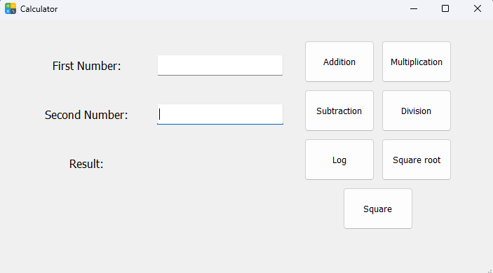

# Basic calculator with pyqt5
A simple calculator performs addition, subtraction, multiplication, division, logarithm, squaring, and square root operations.

## Features
- Addition
- Substraction
- Multiplication
- Division
- Logarithm
- Square root
- Square
## İnstallation and Use
pip install pyqt5  --> requirement
python calculatorApp.py --> runs
